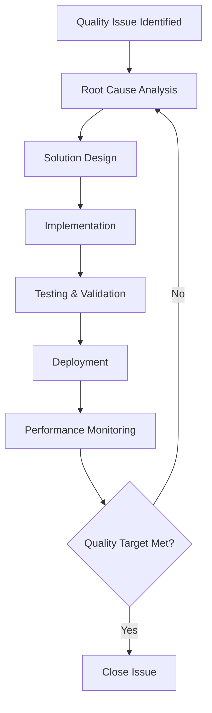

# Quality Assurance Framework

*Comprehensive testing and validation system for prompt engineering excellence.*

---

## 🎯 QA Overview

This framework ensures every prompt in the repository meets professional standards through systematic testing, validation, and continuous improvement.

**Quality Targets:**
- **Individual Prompts**: 8+ rating (expert-level)
- **Cross-Model Performance**: 7+ rating minimum
- **User Satisfaction**: 85%+ effectiveness rating
- **Consistency**: <15% output variance across test cases

---

## 📋 Testing Protocols

### Protocol 1: Pre-Submission Validation

**Step 1: Structural Review**
```markdown
Checklist:
- [ ] Title follows naming convention: [Category] - [Specific Purpose]
- [ ] Tags use standard format: `#primary` `#secondary` `#domain`
- [ ] Variables formatted as: `{descriptive_variable_name}`
- [ ] Code block properly formatted
- [ ] Instructions are imperative and specific
```

**Step 2: Content Quality Assessment**
```markdown
Rate 1-10 on each dimension:
- Clarity: Instructions unambiguous and specific
- Completeness: All necessary context provided
- Expertise: Uses professional frameworks/methodologies
- Efficiency: Token-optimized without quality loss
- Reusability: Applicable across multiple contexts

Minimum score: 7 per dimension for acceptance
Target score: 8+ per dimension for excellence
```

**Step 3: Test Case Execution**
```markdown
Required test inputs:
1. Simple scenario (baseline test)
2. Complex scenario (stress test)
3. Edge case scenario (robustness test)

For each test:
- Execute prompt with test input
- Rate output quality (1-10)
- Check format adherence
- Assess actionability of results
- Document any inconsistencies
```

### Protocol 2: Cross-Model Validation

**Model Testing Matrix:**
```markdown
Test each prompt across:
✓ Claude (latest version) - Primary target
✓ GPT-4 (latest version) - Secondary target  
✓ Open source alternative - Compatibility check

Performance Metrics:
- Output quality score (1-10)
- Format compliance (pass/fail)
- Token efficiency ratio
- Response consistency variance
```

**Optimization Standards:**
- Claude prompts: Leverage constitutional AI, long context
- GPT-4 prompts: Utilize system messages, few-shot patterns
- Universal prompts: Work effectively across all models

### Protocol 3: User Acceptance Testing

**Feedback Collection Framework:**
```markdown
For each new prompt:
1. Internal team testing (2-3 reviewers)
2. Expert domain validation (1 subject matter expert)
3. User pilot testing (5-10 end users)
4. Performance monitoring (30-day observation)

Success Criteria:
- 80%+ reviewers rate as "meets needs"
- 90%+ format compliance in practice
- <20% user requests for clarification
- Positive ROI vs existing solutions
```

---

## 🧪 Test Case Templates

### Template 1: Basic Functionality Test
```markdown
**Prompt ID**: [Category]-[Number]
**Test Type**: Baseline Functionality
**Test Input**: {minimal_viable_scenario}
**Expected Output**: {specific_format_requirements}
**Success Criteria**: 
- Follows specified output format
- Provides actionable recommendations
- Uses appropriate expert-level language
- Completes task within expected scope

**Results**:
- Quality Score: ___/10
- Format Compliance: Pass/Fail
- Actionability: High/Medium/Low
- Notes: _______________
```

### Template 2: Complexity Stress Test
```markdown
**Prompt ID**: [Category]-[Number]
**Test Type**: High Complexity
**Test Input**: {complex_multi_faceted_scenario}
**Expected Output**: {comprehensive_analysis_format}
**Success Criteria**:
- Handles complexity without degradation
- Maintains structure under pressure
- Provides nuanced, expert-level insights
- Scales appropriately to input complexity

**Results**:
- Quality Score: ___/10
- Complexity Handling: Excellent/Good/Poor
- Output Completeness: ____%
- Notes: _______________
```

### Template 3: Edge Case Resilience Test
```markdown
**Prompt ID**: [Category]-[Number]
**Test Type**: Edge Case/Boundary Conditions
**Test Input**: {unusual_or_boundary_scenario}
**Expected Output**: {graceful_handling_or_clear_limitations}
**Success Criteria**:
- Recognizes edge case appropriately
- Provides best-effort response or clear limitations
- Maintains professional tone and format
- Suggests alternatives when applicable

**Results**:
- Quality Score: ___/10
- Edge Case Recognition: Yes/No
- Graceful Handling: Excellent/Good/Poor
- Notes: _______________
```

---

## 📊 Performance Benchmarking

### Quality Metrics Dashboard

**Individual Prompt Metrics:**
```markdown
Prompt Performance Card:
┌─────────────────────────────────┐
│ Prompt: [Name]                  │
│ Category: [Category]            │
│ Quality Score: 8.5/10           │
│ Usage Count: 127                │
│ Success Rate: 94%               │
│ Avg Token Usage: 1,240          │
│ Model Performance:              │
│   Claude: 9.1/10               │
│   GPT-4: 8.2/10                │
│ Last Updated: 2025-08-09        │
└─────────────────────────────────┘
```

**Category Performance Overview:**
```markdown
Category Scorecard:
┌─────────────────────────────────┐
│ Coding Category                 │
│ Total Prompts: 23               │
│ Avg Quality: 8.7/10            │
│ Top Performer: Secure Design    │
│ Needs Improvement: Quick Debug  │
│ User Rating: 4.6/5             │
│ Update Frequency: Monthly       │
└─────────────────────────────────┘
```

### Benchmarking Protocol

**Monthly Quality Review:**
1. **Performance Analysis**: Review all quality metrics
2. **User Feedback Integration**: Incorporate feedback into improvements
3. **Competitive Analysis**: Compare against industry best practices
4. **Model Updates**: Adjust for new AI model capabilities
5. **Standard Updates**: Refine quality standards based on learnings

**Quality Improvement Triggers:**
- Score drops below 7.0 for any prompt
- User satisfaction below 80%
- Consistency variance above 20%
- New superior methodology identified
- Model performance changes significantly

---

## 🔄 Continuous Improvement Process

### Improvement Workflow



### Version Control for Prompts

**Change Management Process:**
1. **Document Current Performance**: Baseline metrics before changes
2. **Implement Improvements**: Make targeted modifications
3. **A/B Testing**: Compare old vs new versions
4. **Performance Validation**: Ensure improvements are measurable
5. **Migration Planning**: Update documentation and references
6. **Rollout**: Deploy improved version with monitoring

### Feedback Integration System

**Feedback Sources:**
- **Direct User Reports**: Bug reports, improvement suggestions
- **Usage Analytics**: Performance data, failure patterns
- **Expert Reviews**: Domain specialist evaluations
- **Automated Monitoring**: Quality drift detection
- **Competitive Intelligence**: Industry best practice updates

**Response Protocol:**
- **Critical Issues**: <24 hours response, immediate fix
- **Quality Improvements**: <7 days assessment, monthly deployment
- **Feature Requests**: <30 days evaluation, quarterly roadmap
- **Standard Updates**: Quarterly review and annual major updates

---

## 🛠️ Tools & Automation

### Automated Quality Checks

**Pre-Commit Hooks:**
```yaml
quality_checks:
  - format_validation: Check variable placeholder syntax
  - tag_compliance: Verify tag format and definitions
  - structure_validation: Ensure required components present
  - token_efficiency: Flag prompts exceeding token budgets
  - duplicate_detection: Prevent redundant prompts
```

**Performance Monitoring:**
```yaml
monitoring_dashboard:
  - usage_analytics: Track prompt usage patterns
  - quality_metrics: Monitor output quality scores
  - user_satisfaction: Collect and trend user ratings
  - model_performance: Track across different AI models
  - error_tracking: Log and categorize failures
```

### Testing Automation

**Automated Test Suite:**
```python
# Example automation framework structure
class PromptQualityTest:
    def test_format_compliance(self):
        # Validate proper formatting
    
    def test_variable_syntax(self):
        # Check {variable} format
    
    def test_output_consistency(self):
        # Run multiple times, check variance
    
    def test_cross_model_performance(self):
        # Test across different AI models
    
    def test_token_efficiency(self):
        # Validate token usage optimization
```

---

## 📈 Success Metrics

### Key Performance Indicators (KPIs)

**Quality KPIs:**
- Average prompt quality score: Target 8.5+/10
- Cross-model consistency: <15% variance
- User satisfaction rate: Target 90%+
- Time-to-value: <5 minutes average

**Operational KPIs:**
- Test coverage: 100% of prompts tested
- Issue resolution time: <7 days average
- Documentation completeness: 100%
- Standard compliance: 95%+

**Innovation KPIs:**
- New prompt additions: 5-10 per month
- Methodology updates: Quarterly
- Framework improvements: Bi-annual
- User-contributed enhancements: Monthly

### ROI Measurement

**Value Metrics:**
- Time savings per prompt usage
- Quality improvement vs baseline
- Reduced iteration cycles
- Increased expert-level output consistency
- Lower training requirements for users

---

*This QA framework ensures systematic excellence and continuous improvement across the entire prompt engineering repository.*